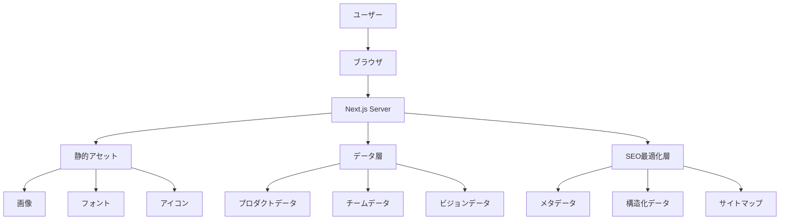
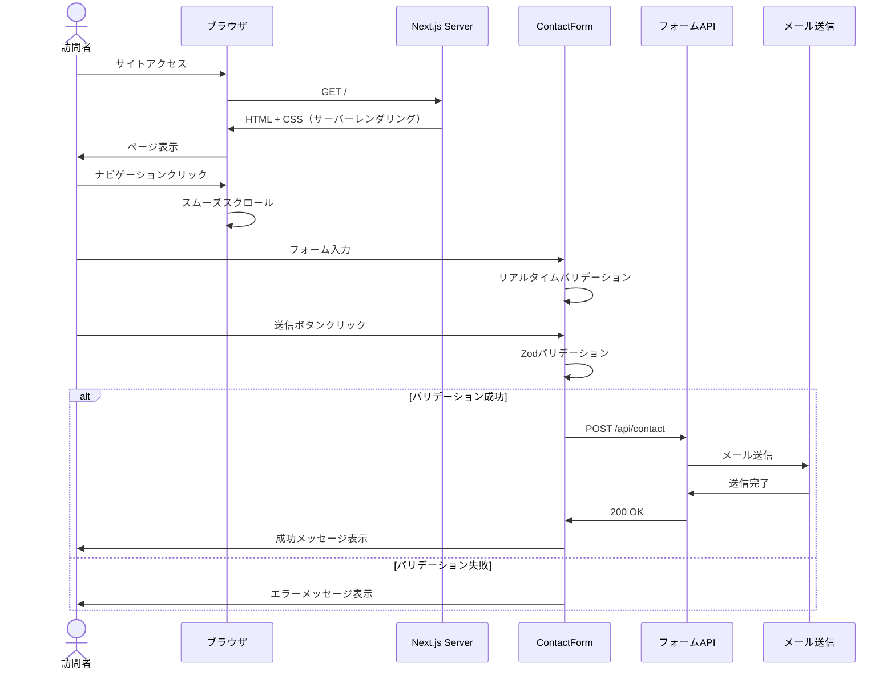
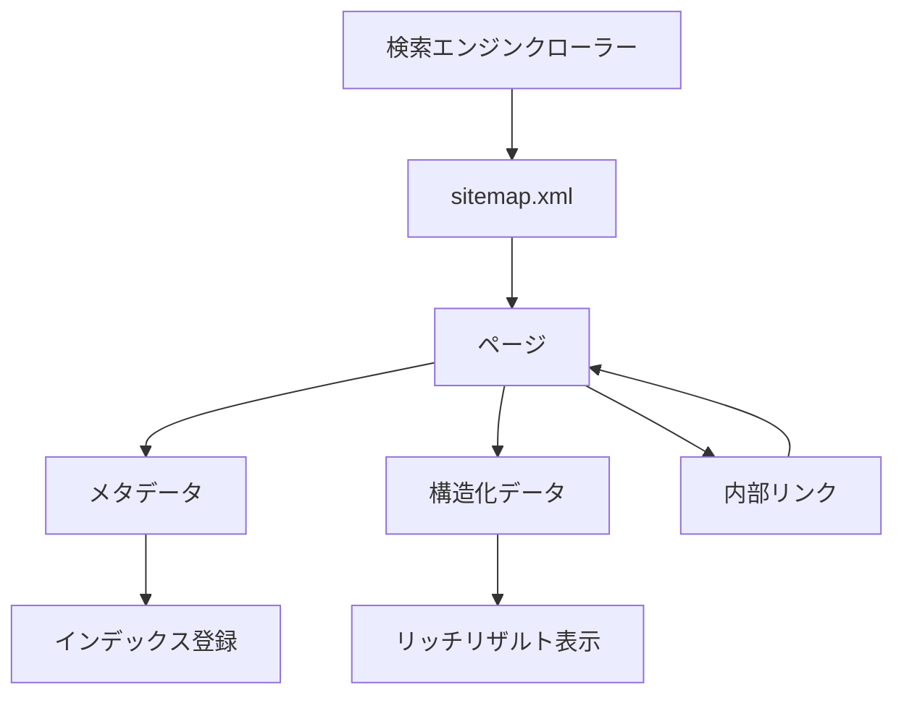

# 技術設計書

## 概要

### 目的

ToMoreBeyondコーポレートサイトは、「埋もれた記録を、続く面白さへ」をコンセプトに、企業のビジョン・提供価値・プロダクトライン・チーム構成を効果的に伝えるWebサイトです。本設計書は、既存のNext.js実装を基盤として、要件定義書で定義された77項目の機能要件を満たす技術設計を提供します。

### ユーザー

- **一般訪問者**: 企業情報、プロダクト情報を閲覧し、興味を持った際にコンタクトを取る
- **運営者**: CMSまたは静的ファイルを通じてコンテンツを更新・管理
- **検索エンジンクローラー**: サイトをインデックスし、検索結果に表示

### 影響範囲

既存のNext.js 15プロジェクトに対して以下の改善を実装します：

- **コンテンツ構造の最適化**: 企業概要、提供価値、プロダクト、チーム、コンタクトセクションの実装改善
- **アクセシビリティ強化**: WCAG 2.1 AA準拠のキーボードナビゲーション、スクリーンリーダー対応
- **SEO最適化**: メタデータ、構造化データ、サイトマップの改善
- **パフォーマンス改善**: Core Web Vitals目標達成のための最適化
- **CMS連携基盤**: 将来的なコンテンツ管理システム統合の準備

### ゴール

1. **ブランド体験の実現**: 「研究所のような温かみとテクノロジー企業の透明感」を表現する統一されたデザインシステム
2. **情報発見性の向上**: 訪問者が企業理念、プロダクト、チームを直感的に理解できるUI/UX
3. **アクセシビリティ確保**: すべてのユーザーが平等にコンテンツにアクセスできる環境
4. **高速なパフォーマンス**: LCP 3秒以内、FCP 2.5秒以内、FID 100ms以内の達成
5. **検索エンジン最適化**: 構造化データとメタデータによる発見性の向上

### 非ゴール

- **多言語対応**: 初期リリースでは日本語のみ対応（将来的に英語対応を検討）
- **ユーザー認証**: 公開サイトのため、認証機能は不要
- **リアルタイム機能**: WebSocketやServer-Sent Eventsは使用しない
- **複雑なインタラクション**: 過度なアニメーションやゲーミフィケーションは避ける
- **動画配信**: 自己ホスト動画の配信基盤は構築しない（外部埋め込みのみ）

## アーキテクチャ

### 既存アーキテクチャ分析

ToMoreBeyondサイトは、Next.js 15のApp Routerパターンを採用した既存実装があります。

**現在の構造**:
- **フレームワーク**: Next.js 15.4.6（App Router）、React 19.1.0
- **スタイリング**: Tailwind CSS v4（カスタムデザインシステム）
- **アニメーション**: Framer Motion + GSAP
- **ディレクトリ構造**:
  - `src/app/`: ルーティングとページ
  - `src/components/`: 再利用可能なコンポーネント（common, effects, layout, sections, ui）
  - `src/data/`: 静的データ（products.ts, team.ts, vision.ts）
  - `src/lib/`: ユーティリティ関数（アニメーション、スクロール処理）

**既存パターンの維持**:
- App Routerのファイルベースルーティング
- コンポーネント分離（Presentational/Container分離）
- 静的データ管理（TypeScript型定義）
- Tailwindデザインシステム（カラーパレット、タイポグラフィ、スペーシング）

**技術的負債の対処**:
- アクセシビリティ対応の追加（ARIA属性、キーボードナビゲーション）
- SEO最適化の強化（メタデータ、構造化データ）
- フォームバリデーションとエラーハンドリングの実装

### 高レベルアーキテクチャ



### アーキテクチャ統合

**既存パターンの保持**:
- Next.js App Routerのサーバーコンポーネント/クライアントコンポーネント分離
- Tailwind CSSデザインシステムの継続使用
- Framer Motion + GSAPによるアニメーション実装
- 静的型付けによるデータ管理

**新規コンポーネントの追加理由**:
- **ContactForm**: フォームバリデーション、エラーハンドリング、送信処理の統合
- **AccessibilityProvider**: キーボードナビゲーション、フォーカス管理の集中制御
- **SEOHead**: メタデータ、構造化データの動的生成
- **RoadmapDisplay**: プロダクトロードマップの視覚化

**技術的整合性**:
- TypeScript厳格モード（`any`型の排除）
- Reactサーバーコンポーネントファースト（クライアントコンポーネントは必要最小限）
- Tailwind CSS v4のCSS-in-JS機能活用
- 画像最適化（Next.js Image）

**ステアリング準拠**:
- ステアリングファイル未作成のため、既存コードベースから推測したベストプラクティスに従う
- 今後、`.kiro/steering/structure.md`, `tech.md`, `product.md`を作成して明文化

## 技術スタック整合性

### 既存技術スタックの継続使用

| レイヤー | 技術 | 選定理由 |
|---------|------|---------|
| **フレームワーク** | Next.js 15.4.6 | App Router、React Server Components、自動最適化 |
| **UIライブラリ** | React 19.1.0 | 最新の並行機能、Suspense、サーバーコンポーネント |
| **言語** | TypeScript 5 | 型安全性、開発者体験、エディタサポート |
| **スタイリング** | Tailwind CSS v4 | デザインシステム、レスポンシブ、パフォーマンス |
| **アニメーション** | Framer Motion + GSAP | 宣言的アニメーション、高度なタイムライン制御 |
| **アイコン** | Lucide React + Heroicons | 一貫性、カスタマイズ性、アクセシビリティ |

### 新規依存関係の追加

| ライブラリ | 用途 | 選定理由 |
|-----------|------|---------|
| **react-hook-form** | フォーム管理 | パフォーマンス、バリデーション、TypeScript対応 |
| **zod** | スキーマバリデーション | 型安全、ランタイムバリデーション、エラーメッセージ |
| **@vercel/analytics** | Webアナリティクス | プライバシー重視、パフォーマンス影響最小 |
| **next-sitemap** | サイトマップ生成 | 自動生成、動的ルート対応 |

### 主要技術決定

#### 決定1: React Server ComponentsとClient Componentsの分離

**決定**: ページとレイアウトをサーバーコンポーネントとして実装し、インタラクティブな要素のみをクライアントコンポーネントとする

**コンテキスト**: Next.js 15のApp Routerはデフォルトでサーバーコンポーネントを使用し、JavaScriptバンドルサイズを削減できる

**代替案**:
1. すべてをクライアントコンポーネントにする（従来のSPA方式）
2. すべてをサーバーコンポーネントにする（インタラクションなし）
3. **選択**: ハイブリッド方式（サーバーファースト、必要に応じてクライアント）

**選択アプローチの詳細**:
```typescript
// サーバーコンポーネント（デフォルト）
// src/app/page.tsx
export default function HomePage() {
  return (
    <>
      <HeroSection />      // サーバーコンポーネント
      <AboutSection />     // サーバーコンポーネント
      <ProductsSection />  // サーバーコンポーネント
      <ContactForm />      // クライアントコンポーネント（"use client"）
    </>
  );
}

// クライアントコンポーネント
// src/components/sections/ContactSection.tsx
"use client";
export function ContactForm() {
  const [formData, setFormData] = useState({...});
  // インタラクティブロジック
}
```

**理由**:
- JavaScriptバンドルサイズ削減（初期ロード高速化）
- SEOフレンドリー（サーバーサイドレンダリング）
- 段階的なハイドレーション（必要な部分のみクライアント実行）

**トレードオフ**:
- **獲得**: パフォーマンス、SEO、初期ロード速度
- **犠牲**: クライアント/サーバー境界の明示的管理、useState/useEffectの使用制限

#### 決定2: Tailwind CSS v4のネイティブCSS変数システムの活用

**決定**: Tailwind CSS v4の新しいCSS変数ベースのデザインシステムを採用し、ダークモード対応を容易にする

**コンテキスト**: Tailwind CSS v4はネイティブCSS変数を活用し、動的なテーマ切り替えが容易になる

**代替案**:
1. Tailwind CSS v3を使い続ける
2. CSS-in-JS（styled-components、emotion）に移行
3. **選択**: Tailwind CSS v4のCSS変数システム

**選択アプローチの詳細**:
```css
/* globals.css */
@tailwind base;
@tailwind components;
@tailwind utilities;

@layer base {
  :root {
    --color-primary-500: 215 122 79;  /* #D77A4F */
    --color-olive-900: 15 30 20;
    --background: 248 247 245;
    --foreground: 15 30 20;
  }

  @media (prefers-color-scheme: dark) {
    :root {
      --background: 26 26 26;
      --foreground: 250 250 250;
    }
  }
}
```

**理由**:
- ネイティブCSS変数によるパフォーマンス向上
- ダークモード対応の簡素化
- カスタムプロパティの動的変更が容易

**トレードオフ**:
- **獲得**: ダークモード対応、動的テーマ切り替え、パフォーマンス
- **犠牲**: Tailwind v3との互換性

#### 決定3: フォームバリデーションにZod + React Hook Formを使用

**決定**: フォームバリデーションとエラーハンドリングにZodスキーマとReact Hook Formを組み合わせる

**コンテキスト**: コンタクトフォームは型安全なバリデーション、明確なエラーメッセージ、アクセシビリティ対応が必要

**代替案**:
1. ネイティブHTML5バリデーションのみ
2. Formik + Yup
3. **選択**: React Hook Form + Zod

**選択アプローチの詳細**:
```typescript
import { z } from "zod";
import { useForm } from "react-hook-form";
import { zodResolver } from "@hookform/resolvers/zod";

const contactSchema = z.object({
  name: z.string().min(1, "名前を入力してください"),
  email: z.string().email("有効なメールアドレスを入力してください"),
  message: z.string().min(10, "メッセージは10文字以上入力してください"),
});

type ContactFormData = z.infer<typeof contactSchema>;

export function ContactForm() {
  const { register, handleSubmit, formState: { errors } } = useForm<ContactFormData>({
    resolver: zodResolver(contactSchema),
  });

  const onSubmit = async (data: ContactFormData) => {
    // 送信処理
  };
}
```

**理由**:
- TypeScript型推論（スキーマから型を自動生成）
- ランタイムバリデーション（型安全性の保証）
- パフォーマンス（非制御コンポーネント）
- アクセシビリティ（ARIA属性の自動設定）

**トレードオフ**:
- **獲得**: 型安全性、パフォーマンス、開発者体験
- **犠牲**: 依存関係の追加、学習コスト

## システムフロー

### ユーザーインタラクションフロー



### SEOクローラーフロー



## 要件トレーサビリティ

主要な要件と実現コンポーネントのマッピング：

| 要件 | 要件概要 | 実現コンポーネント | インターフェース | フロー |
|------|---------|------------------|----------------|-------|
| 1.1-1.6 | サイト概要とビジョン表示 | HeroSection, VisionSection, AboutSection | HeroSectionProps, VisionSectionProps | ユーザーインタラクションフロー |
| 2.1-2.5 | 提供価値の明確化 | ValuePropositionSection | ValueCardProps | - |
| 3.1-3.10 | プロダクトライン紹介 | ProductsSection, ProductCard, RoadmapDisplay | ProductCardProps, Product型 | - |
| 4.1-4.8 | チーム構成の紹介 | TeamSection, TeamMemberCard | TeamMemberProps, TeamMember型 | - |
| 5.1-5.8 | お問い合わせ機能 | ContactForm, ContactSection | ContactFormData, submitContactForm | ユーザーインタラクションフロー |
| 6.1-6.8 | レスポンシブ&アクセシビリティ | ResponsiveLayout, AccessibilityProvider | - | - |
| 7.1-7.8 | パフォーマンスとSEO | SEOHead, ImageOptimizer, sitemap.ts | Metadata型, generateMetadata | SEOクローラーフロー |
| 8.1-8.8 | デザインシステム | Tailwind設定, デザイントークン | DesignTokens型 | - |
| 9.1-9.8 | ナビゲーション | Header, Navigation, Footer | NavigationProps | ユーザーインタラクションフロー |
| 10.1-10.8 | ロードマップとCMS | RoadmapDisplay, CMSAdapter | RoadmapData型, CMSInterface | - |

## コンポーネントとインターフェース

### プレゼンテーション層

#### HeroSection

**責任と境界**
- **主要責任**: トップページのヒーローセクションを表示し、企業名、キャッチコピー、ビジュアルを提供
- **ドメイン境界**: UIプレゼンテーション層
- **データ所有**: なし（親から受け取ったpropsを表示）
- **トランザクション境界**: なし（読み取り専用コンポーネント）

**依存関係**
- **Inbound**: `src/app/page.tsx`（親ページ）
- **Outbound**: AnimatedLogo, GeometricShapes, Framer Motion
- **External**: Framer Motion（アニメーション）

**契約定義**

```typescript
interface HeroSectionProps {
  title: string;              // 企業名
  taglineEn: string;          // 英語キャッチコピー
  taglineJa: string;          // 日本語キャッチコピー
  ctaText?: string;           // CTAボタンテキスト（任意）
  ctaHref?: string;           // CTAリンク先（任意）
}

// 使用例
<HeroSection
  title="ToMoreBeyond"
  taglineEn="Making hidden traces a lasting wonder"
  taglineJa="埋もれた記録を、続く面白さへ"
  ctaText="詳しく見る"
  ctaHref="#about"
/>
```

**事前条件**: なし
**事後条件**: ヒーローセクションが視覚的に目立つ形で表示される
**不変条件**: title、taglineEn、taglineJaは常に表示される

#### ProductCard

**責任と境界**
- **主要責任**: 個別プロダクトの情報を視覚的に表示し、クリックで詳細ページへ遷移
- **ドメイン境界**: UIプレゼンテーション層
- **データ所有**: なし（Product型データを表示）
- **トランザクション境界**: なし

**依存関係**
- **Inbound**: ProductsSection
- **Outbound**: Next.js Link, InteractiveCard
- **External**: Lucide React（アイコン）

**契約定義**

```typescript
interface Product {
  id: string;
  name: string;
  nameJa: string;
  tagline: string;
  description: string;
  features: string[];
  status: "released" | "in_development" | "planned";
  roadmapUrl?: string;
  imageUrl: string;
  detailUrl: string;
}

interface ProductCardProps {
  product: Product;
  variant?: "default" | "compact" | "featured";
}

// 使用例
<ProductCard
  product={{
    id: "tadataka",
    name: "TADATAKA",
    nameJa: "忠嵩",
    tagline: "あなたの歩いた道が、そのまま日記になる",
    description: "GPS・BLE・加速度センサーを用いた高精度の移動記録アプリ",
    features: ["高精度移動記録", "プライバシー保護", "美しい地図表示"],
    status: "released",
    roadmapUrl: "/products/tadataka/roadmap",
    imageUrl: "/images/products/tadataka.png",
    detailUrl: "/products/tadataka"
  }}
  variant="featured"
/>
```

**事前条件**: Product型データが有効である
**事後条件**: プロダクトカードが視覚的に区別可能な形で表示され、クリック可能である
**不変条件**: statusに応じて適切なバッジが表示される

#### ContactForm

**責任と境界**
- **主要責任**: ユーザーからの問い合わせ情報を収集し、バリデーション後にサーバーへ送信
- **ドメイン境界**: UIプレゼンテーション層 + フォームロジック
- **データ所有**: フォーム状態（React Hook Form）
- **トランザクション境界**: フォーム送信（クライアント→サーバー）

**依存関係**
- **Inbound**: ContactSection
- **Outbound**: `/api/contact`（サーバーAPI）
- **External**: React Hook Form, Zod

**契約定義**

```typescript
const contactFormSchema = z.object({
  name: z.string().min(1, "名前を入力してください").max(100, "名前は100文字以内で入力してください"),
  email: z.string().email("有効なメールアドレスを入力してください"),
  message: z.string().min(10, "メッセージは10文字以上入力してください").max(2000, "メッセージは2000文字以内で入力してください"),
});

type ContactFormData = z.infer<typeof contactFormSchema>;

interface ContactFormProps {
  onSubmitSuccess?: () => void;
  onSubmitError?: (error: Error) => void;
}

interface ContactFormState {
  status: "idle" | "submitting" | "success" | "error";
  message?: string;
}
```

**事前条件**: なし
**事後条件（成功時）**: フォームデータがサーバーに送信され、成功メッセージが表示される
**事後条件（失敗時）**: エラーメッセージが表示され、フォームは再送信可能な状態を維持
**不変条件**: バリデーションエラーがある場合、送信ボタンは無効化される

**APIエンドポイント**

| Method | Endpoint | Request | Response | Errors |
|--------|----------|---------|----------|--------|
| POST | /api/contact | ContactFormData | { success: true, message: string } | 400, 500 |

**リクエストスキーマ**:
```typescript
{
  "name": "山田太郎",
  "email": "yamada@example.com",
  "message": "お問い合わせ内容をこちらに記入します。"
}
```

**レスポンススキーマ（成功）**:
```typescript
{
  "success": true,
  "message": "お問い合わせありがとうございます。担当者から連絡いたします。"
}
```

**レスポンススキーマ（失敗）**:
```typescript
{
  "success": false,
  "error": "バリデーションエラー",
  "details": {
    "email": "有効なメールアドレスを入力してください"
  }
}
```

### データ管理層

#### データストア構造

現在の実装では、プロダクト、チーム、ビジョン情報は静的TypeScriptファイルで管理されています。

```typescript
// src/data/products.ts
export interface Product {
  id: string;
  name: string;
  nameJa: string;
  tagline: string;
  description: string;
  features: string[];
  status: "released" | "in_development" | "planned";
  roadmapUrl?: string;
  imageUrl: string;
  detailUrl: string;
}

export const products: Product[] = [
  {
    id: "tadataka",
    name: "TADATAKA",
    nameJa: "忠嵩",
    // ...
  },
  // ...
];
```

```typescript
// src/data/team.ts
export interface TeamMember {
  id: string;
  name: string;
  nameRomaji: string;
  role: string;
  roleJa: string;
  message: string;
  imageUrl: string;
  detailUrl: string;
}

export const team: TeamMember[] = [
  {
    id: "yamada",
    name: "山田",
    nameRomaji: "Yamada",
    role: "Chief Design Officer",
    roleJa: "CDO（チーフデザインオフィサー）",
    message: "チーフデザイナー。異なる視点で世界を観察し、形にしていくことが役割。",
    imageUrl: "/images/team/yamada.jpg",
    detailUrl: "/team/yamada"
  },
  // ...
];
```

**CMS連携準備**: 将来的なCMS統合のため、データアクセス層を抽象化

```typescript
// src/lib/cms-adapter.ts
export interface CMSAdapter {
  getProducts(): Promise<Product[]>;
  getProduct(id: string): Promise<Product | null>;
  getTeamMembers(): Promise<TeamMember[]>;
  getTeamMember(id: string): Promise<TeamMember | null>;
  getRoadmap(productId: string): Promise<RoadmapData | null>;
}

// 静的データアダプター（現在）
export class StaticDataAdapter implements CMSAdapter {
  async getProducts(): Promise<Product[]> {
    return products;
  }

  async getProduct(id: string): Promise<Product | null> {
    return products.find(p => p.id === id) || null;
  }

  // ...
}

// 将来のCMSアダプター例
export class ContentfulAdapter implements CMSAdapter {
  async getProducts(): Promise<Product[]> {
    const entries = await contentfulClient.getEntries({ content_type: 'product' });
    return entries.items.map(mapToProduct);
  }

  // ...
}
```

### ユーティリティ層

#### SEO最適化ユーティリティ

```typescript
// src/lib/seo.ts
import { Metadata } from "next";

export interface SEOConfig {
  title: string;
  description: string;
  url: string;
  image?: string;
  type?: "website" | "article";
  keywords?: string[];
}

export function generateMetadata(config: SEOConfig): Metadata {
  return {
    title: config.title,
    description: config.description,
    keywords: config.keywords,
    openGraph: {
      title: config.title,
      description: config.description,
      url: config.url,
      type: config.type || "website",
      images: config.image ? [{ url: config.image }] : undefined,
    },
    twitter: {
      card: "summary_large_image",
      title: config.title,
      description: config.description,
      images: config.image ? [config.image] : undefined,
    },
  };
}

export function generateStructuredData(type: "Organization" | "WebSite", data: Record<string, unknown>) {
  return {
    "@context": "https://schema.org",
    "@type": type,
    ...data,
  };
}
```

## データモデル

### ドメインモデル

#### コアエンティティ

```typescript
// 企業情報
interface Organization {
  name: string;
  nameJa: string;
  taglineEn: string;
  taglineJa: string;
  concept: string;
  mission: string;
  foundingDate: string;
  address: Address;
}

interface Address {
  locality: string;      // Tokyo
  country: string;        // JP
}

// プロダクトアグリゲート
interface Product {
  id: string;              // 一意識別子
  name: string;            // 英語名
  nameJa: string;          // 日本語名
  tagline: string;         // キャッチコピー
  description: string;     // 説明
  features: Feature[];     // 特徴リスト
  status: ProductStatus;   // ステータス
  roadmap?: Roadmap;       // ロードマップ（任意）
  metadata: ProductMetadata;
}

type ProductStatus = "released" | "in_development" | "planned";

interface Feature {
  title: string;
  description: string;
  icon?: string;
}

interface Roadmap {
  phases: RoadmapPhase[];
}

interface RoadmapPhase {
  id: string;
  title: string;
  description: string;
  status: "completed" | "in_progress" | "planned";
  targetDate?: string;     // ISO 8601形式
  features: string[];
}

interface ProductMetadata {
  imageUrl: string;
  detailUrl: string;
  externalUrl?: string;
}

// チームメンバーアグリゲート
interface TeamMember {
  id: string;
  name: string;
  nameRomaji: string;
  role: Role;
  message: string;
  metadata: TeamMemberMetadata;
}

interface Role {
  titleEn: string;         // Chief Design Officer
  titleJa: string;         // CDO（チーフデザインオフィサー）
  abbreviation: string;    // CDO
  description: string;     // 役割説明
}

interface TeamMemberMetadata {
  imageUrl: string;
  detailUrl: string;
  socialLinks?: SocialLink[];
}

interface SocialLink {
  platform: "twitter" | "linkedin" | "github";
  url: string;
}
```

#### 値オブジェクト

```typescript
// 連絡先情報
interface ContactInquiry {
  name: ContactName;
  email: Email;
  message: Message;
  submittedAt: Date;
}

class ContactName {
  private readonly value: string;

  constructor(value: string) {
    if (value.length < 1 || value.length > 100) {
      throw new Error("名前は1〜100文字で入力してください");
    }
    this.value = value;
  }

  toString(): string {
    return this.value;
  }
}

class Email {
  private readonly value: string;

  constructor(value: string) {
    const emailRegex = /^[^\s@]+@[^\s@]+\.[^\s@]+$/;
    if (!emailRegex.test(value)) {
      throw new Error("有効なメールアドレスを入力してください");
    }
    this.value = value;
  }

  toString(): string {
    return this.value;
  }
}

class Message {
  private readonly value: string;

  constructor(value: string) {
    if (value.length < 10 || value.length > 2000) {
      throw new Error("メッセージは10〜2000文字で入力してください");
    }
    this.value = value;
  }

  toString(): string {
    return this.value;
  }
}
```

### データ整合性と制約

**ビジネスルール**:
1. プロダクトのステータスが`"in_development"`の場合、開発中バッジを表示する
2. ロードマップが存在するプロダクトのみ、ロードマップリンクを表示する
3. チームメンバーの役職は必ず英語と日本語の両方を持つ
4. 問い合わせフォームのメッセージは10文字以上必須

**参照整合性**:
- ProductのdetailUrlは`/products/[id]`形式に従う
- TeamMemberのdetailUrlは`/team/[id]`形式に従う

**一時的制約**:
- ContactInquiryは送信後、サーバーログに保存され、メール送信される（データベース保存は将来実装）

## エラーハンドリング

### エラー戦略

ToMoreBeyondサイトは、ユーザー体験を損なわないエラーハンドリングを実装します。

**エラーカテゴリ**:

1. **ユーザーエラー（4xx）**: フォーム入力、ナビゲーション、リソース不存在
2. **システムエラー（5xx）**: サーバー障害、タイムアウト、外部API障害
3. **ビジネスロジックエラー（422）**: バリデーション失敗、状態不整合

### エラーカテゴリと対応

#### ユーザーエラー（4xx）

| エラータイプ | HTTP | 対応策 | 表示メッセージ |
|-------------|------|--------|--------------|
| 無効な入力 | 400 | フィールドレベルバリデーション | "有効なメールアドレスを入力してください" |
| ページ不存在 | 404 | カスタム404ページ、トップへ誘導 | "お探しのページが見つかりません" |
| アクセス拒否 | 403 | - | （公開サイトのため発生しない） |

**実装例**:
```typescript
// src/app/not-found.tsx
export default function NotFound() {
  return (
    <div className="min-h-screen flex items-center justify-center">
      <div className="text-center">
        <h1 className="text-display font-bold text-olive-900">404</h1>
        <p className="text-body text-gray-600 mt-4">お探しのページが見つかりません</p>
        <Link href="/" className="mt-8 inline-block text-primary-500 hover:text-primary-600">
          トップページへ戻る
        </Link>
      </div>
    </div>
  );
}
```

#### システムエラー（5xx）

| エラータイプ | HTTP | 対応策 | 表示メッセージ |
|-------------|------|--------|--------------|
| サーバーエラー | 500 | エラーバウンダリ、再試行ボタン | "エラーが発生しました。しばらくしてから再度お試しください。" |
| タイムアウト | 504 | 再試行、オフライン検出 | "接続がタイムアウトしました。インターネット接続を確認してください。" |
| 外部API障害 | 502 | グレースフルデグラデーション | "一部の機能が一時的に利用できません。" |

**実装例**:
```typescript
// src/app/error.tsx
"use client";
import { useEffect } from "react";

export default function Error({
  error,
  reset,
}: {
  error: Error & { digest?: string };
  reset: () => void;
}) {
  useEffect(() => {
    console.error("Application error:", error);
  }, [error]);

  return (
    <div className="min-h-screen flex items-center justify-center">
      <div className="text-center max-w-md">
        <h2 className="text-headline font-semibold text-olive-900">エラーが発生しました</h2>
        <p className="text-body text-gray-600 mt-4">
          申し訳ございません。予期しないエラーが発生しました。
        </p>
        <button
          onClick={reset}
          className="mt-8 px-6 py-3 bg-primary-500 text-white rounded-lg hover:bg-primary-600"
        >
          再試行
        </button>
      </div>
    </div>
  );
}
```

#### ビジネスロジックエラー（422）

| エラータイプ | 対応策 | 表示メッセージ |
|-------------|--------|--------------|
| フォームバリデーション失敗 | フィールド横にエラー表示 | "メッセージは10文字以上入力してください" |
| 重複送信検出 | 送信ボタン無効化 | "送信中です。しばらくお待ちください。" |

**実装例**:
```typescript
// ContactFormでのバリデーションエラー表示
{errors.email && (
  <p className="mt-1 text-sm text-red-600" role="alert" aria-live="polite">
    {errors.email.message}
  </p>
)}
```

### モニタリング

**エラートラッキング**:
- Vercel Analyticsによる自動エラートラッキング
- コンソールエラーのログ記録

**ヘルスモニタリング**:
- Next.js組み込みのヘルスチェック（`/api/health`）
- Vercel Deploymentステータス監視

## テスト戦略

### ユニットテスト

**対象**: 個別コンポーネント、ユーティリティ関数、データ変換ロジック

**主要テスト項目**:

1. **フォームバリデーション（contactFormSchema）**
   - 有効なデータでバリデーション成功
   - 無効なメールアドレスでバリデーション失敗
   - 空の名前フィールドでバリデーション失敗
   - 9文字のメッセージでバリデーション失敗
   - 2001文字のメッセージでバリデーション失敗

2. **SEOユーティリティ（generateMetadata）**
   - 完全なSEOConfigでメタデータ生成
   - 画像なしでメタデータ生成
   - 構造化データ（Organization）生成

3. **データアダプター（StaticDataAdapter）**
   - getProducts()で全プロダクト取得
   - getProduct(id)で個別プロダクト取得
   - 存在しないIDでnull返却

**テストフレームワーク**: Jest + React Testing Library

```typescript
// __tests__/lib/contact-validation.test.ts
import { contactFormSchema } from "@/lib/contact-validation";

describe("contactFormSchema", () => {
  it("有効なデータでバリデーション成功", () => {
    const validData = {
      name: "山田太郎",
      email: "yamada@example.com",
      message: "お問い合わせ内容です。",
    };

    const result = contactFormSchema.safeParse(validData);
    expect(result.success).toBe(true);
  });

  it("無効なメールアドレスでバリデーション失敗", () => {
    const invalidData = {
      name: "山田太郎",
      email: "invalid-email",
      message: "お問い合わせ内容です。",
    };

    const result = contactFormSchema.safeParse(invalidData);
    expect(result.success).toBe(false);
  });
});
```

### インテグレーションテスト

**対象**: コンポーネント間連携、API統合、フォーム送信フロー

**主要テスト項目**:

1. **ContactFormフォーム送信フロー**
   - ユーザーがフォームに入力して送信
   - バリデーションエラー時にエラーメッセージ表示
   - 送信成功時に成功メッセージ表示
   - 送信中はボタン無効化

2. **プロダクト一覧表示**
   - ProductsSectionが全プロダクトを表示
   - 開発中ステータスのプロダクトにバッジ表示
   - クリックで詳細ページへ遷移

3. **ナビゲーション**
   - ヘッダーのリンククリックでスムーズスクロール
   - モバイルメニュー開閉
   - ロゴクリックでトップへ戻る

```typescript
// __tests__/components/ContactForm.test.tsx
import { render, screen, waitFor } from "@testing-library/react";
import userEvent from "@testing-library/user-event";
import ContactForm from "@/components/sections/ContactForm";

describe("ContactForm", () => {
  it("フォーム送信成功時に成功メッセージ表示", async () => {
    const user = userEvent.setup();
    render(<ContactForm />);

    await user.type(screen.getByLabelText(/名前/i), "山田太郎");
    await user.type(screen.getByLabelText(/メールアドレス/i), "yamada@example.com");
    await user.type(screen.getByLabelText(/メッセージ/i), "お問い合わせ内容です。");
    await user.click(screen.getByRole("button", { name: /送信/i }));

    await waitFor(() => {
      expect(screen.getByText(/お問い合わせありがとうございます/i)).toBeInTheDocument();
    });
  });
});
```

### E2Eテスト

**対象**: ユーザーシナリオ、ページ遷移、クリティカルパス

**主要テスト項目**:

1. **トップページからプロダクト詳細へのフロー**
   - トップページアクセス
   - プロダクトカードクリック
   - 詳細ページ表示確認
   - ロードマップリンククリック（存在する場合）

2. **お問い合わせフォーム送信**
   - コンタクトセクションへスクロール
   - フォーム入力
   - 送信
   - 成功メッセージ確認

3. **レスポンシブナビゲーション**
   - モバイルビューポートでアクセス
   - ハンバーガーメニュー開閉
   - ナビゲーションリンククリック
   - セクションへスクロール

**テストフレームワーク**: Playwright

```typescript
// e2e/contact-form.spec.ts
import { test, expect } from "@playwright/test";

test("お問い合わせフォーム送信成功", async ({ page }) => {
  await page.goto("/");

  // コンタクトセクションへスクロール
  await page.getByRole("link", { name: /お問い合わせ/i }).click();

  // フォーム入力
  await page.getByLabel(/名前/i).fill("山田太郎");
  await page.getByLabel(/メールアドレス/i).fill("yamada@example.com");
  await page.getByLabel(/メッセージ/i).fill("お問い合わせ内容をこちらに記入します。");

  // 送信
  await page.getByRole("button", { name: /送信/i }).click();

  // 成功メッセージ確認
  await expect(page.getByText(/お問い合わせありがとうございます/i)).toBeVisible();
});
```

### パフォーマンステスト

**対象**: Core Web Vitals、読み込み速度、画像最適化

**主要テスト項目**:

1. **Lighthouse監査**
   - Performance: 90以上
   - Accessibility: 95以上
   - Best Practices: 95以上
   - SEO: 100

2. **Core Web Vitals**
   - LCP < 3秒
   - FCP < 2.5秒
   - FID < 100ms
   - CLS < 0.1

3. **画像最適化**
   - WebP形式での配信
   - レスポンシブ画像（srcset）
   - 遅延読み込み（lazy loading）

4. **バンドルサイズ**
   - 初期JavaScriptバンドル < 200KB（gzip）
   - クライアントコンポーネント最小化

## パフォーマンスとスケーラビリティ

### パフォーマンス目標

**Core Web Vitals**:
- **LCP（Largest Contentful Paint）**: 3秒以内
- **FCP（First Contentful Paint）**: 2.5秒以内
- **FID（First Input Delay）**: 100ミリ秒以内
- **CLS（Cumulative Layout Shift）**: 0.1以下

### 最適化戦略

#### 画像最適化

```typescript
// Next.js Imageコンポーネントの使用
import Image from "next/image";

<Image
  src="/images/products/tadataka.png"
  alt="TADATAKA - 移動記録アプリ"
  width={800}
  height={600}
  loading="lazy"
  placeholder="blur"
  blurDataURL={blurDataURL}
  sizes="(max-width: 768px) 100vw, (max-width: 1200px) 50vw, 33vw"
/>
```

**最適化内容**:
- WebP/AVIF自動変換
- レスポンシブ画像（srcset）
- 遅延読み込み（lazy loading）
- ぼかしプレースホルダー

#### コード分割

```typescript
// 動的インポートによるコード分割
import dynamic from "next/dynamic";

const ContactForm = dynamic(() => import("@/components/sections/ContactForm"), {
  loading: () => <div>読み込み中...</div>,
  ssr: false,  // クライアントサイドのみ
});
```

#### キャッシング戦略

**静的生成（SSG）**:
- トップページ、About、Vision、Products一覧
- ビルド時に生成、CDN配信

**動的ルート（ISR）**:
- プロダクト詳細ページ（`/products/[id]`）
- チーム詳細ページ（`/team/[id]`）
- Revalidate: 3600秒（1時間）

**クライアントサイドキャッシュ**:
- SWR（Stale-While-Revalidate）パターン
- 画像キャッシュ（ブラウザキャッシュ）

### スケーラビリティ

**水平スケーリング**:
- Vercel自動スケーリング（サーバーレス関数）
- CDN配信（静的アセット）

**垂直スケーリング**:
- 現時点では不要（静的サイト）

**データスケーリング**:
- 現在は静的データ（数十件のプロダクト、チームメンバー）
- 将来的なCMS統合時はAPI呼び出しキャッシング

## セキュリティ考慮事項

### 脅威モデル

**想定される脅威**:
1. **スパムフォーム送信**: ボット攻撃、大量送信
2. **XSS（Cross-Site Scripting）**: ユーザー入力の不適切な処理
3. **CSRF（Cross-Site Request Forgery）**: 悪意あるサイトからのフォーム送信
4. **情報漏洩**: 環境変数、APIキーの露出

### セキュリティ対策

#### フォーム保護

**スパム対策**:
```typescript
// Vercel Edge Ratelimitの使用
import { Ratelimit } from "@upstash/ratelimit";
import { Redis } from "@upstash/redis";

const ratelimit = new Ratelimit({
  redis: Redis.fromEnv(),
  limiter: Ratelimit.slidingWindow(5, "1 h"),  // 1時間あたり5回まで
});

export async function POST(request: Request) {
  const ip = request.headers.get("x-forwarded-for") ?? "unknown";
  const { success } = await ratelimit.limit(ip);

  if (!success) {
    return new Response("Too many requests", { status: 429 });
  }

  // フォーム処理
}
```

**CSRF保護**:
- Next.js組み込みのCSRF保護（Server Actions）
- SameSite Cookie属性

#### XSS対策

**入力サニタイゼーション**:
```typescript
import DOMPurify from "isomorphic-dompurify";

function sanitizeInput(input: string): string {
  return DOMPurify.sanitize(input, {
    ALLOWED_TAGS: [],  // HTMLタグを許可しない
    ALLOWED_ATTR: [],
  });
}
```

**Content Security Policy（CSP）**:
```typescript
// next.config.ts
const securityHeaders = [
  {
    key: "Content-Security-Policy",
    value: [
      "default-src 'self'",
      "script-src 'self' 'unsafe-eval' 'unsafe-inline'",  // Next.js要件
      "style-src 'self' 'unsafe-inline'",  // Tailwind要件
      "img-src 'self' data: https:",
      "font-src 'self' data:",
      "connect-src 'self' https://vitals.vercel-insights.com",
    ].join("; "),
  },
];

export default {
  async headers() {
    return [
      {
        source: "/:path*",
        headers: securityHeaders,
      },
    ];
  },
};
```

#### 環境変数保護

```typescript
// 環境変数の型定義と検証
const envSchema = z.object({
  NEXT_PUBLIC_SITE_URL: z.string().url(),
  CONTACT_EMAIL: z.string().email(),
  SMTP_HOST: z.string(),
  SMTP_PORT: z.string(),
  SMTP_USER: z.string(),
  SMTP_PASS: z.string(),
});

export const env = envSchema.parse(process.env);
```

**.env.local（例）**:
```bash
# 公開環境変数（クライアント側で利用可能）
NEXT_PUBLIC_SITE_URL=https://tomorebeyond.co

# サーバー環境変数（サーバー側のみ）
CONTACT_EMAIL=contact@tomorebeyond.co
SMTP_HOST=smtp.gmail.com
SMTP_PORT=587
SMTP_USER=noreply@tomorebeyond.co
SMTP_PASS=your_smtp_password
```

### コンプライアンス

**プライバシーポリシー**:
- Vercel Analytics使用に関する開示
- フォーム送信データの取り扱い

**アクセシビリティ**:
- WCAG 2.1 AA準拠

## 実装ロードマップ

実装は以下のフェーズで段階的に進行します：

### フェーズ1: 基盤整備（1週間）

- [ ] プロジェクトセットアップ（既存コードベースの確認）
- [ ] 依存関係追加（react-hook-form, zod, @vercel/analytics）
- [ ] 型定義の強化（`any`型の排除）
- [ ] アクセシビリティ基盤（AccessibilityProvider、キーボードナビゲーション）

### フェーズ2: コア機能実装（2週間）

- [ ] ContactFormリファクタリング（React Hook Form + Zod）
- [ ] フォームAPI実装（`/api/contact`）
- [ ] SEO最適化（メタデータ、構造化データ）
- [ ] レスポンシブデザイン調整

### フェーズ3: パフォーマンス最適化（1週間）

- [ ] 画像最適化（WebP変換、lazy loading）
- [ ] コード分割（動的インポート）
- [ ] Core Web Vitals測定と改善
- [ ] Lighthouseスコア90以上達成

### フェーズ4: テストとデプロイ（1週間）

- [ ] ユニットテスト作成
- [ ] インテグレーションテスト作成
- [ ] E2Eテスト作成（Playwright）
- [ ] ステージング環境デプロイ
- [ ] 本番環境デプロイ

### フェーズ5: CMS連携準備（1週間、将来）

- [ ] CMSAdapterインターフェース実装
- [ ] Contentful/Sanity統合検討
- [ ] 動的コンテンツ管理基盤

---

## 設計完了

本技術設計書は、ToMoreBeyondコーポレートサイトの要件定義書で定義された77項目の機能要件を満たすための包括的な技術設計を提供します。既存のNext.js 15実装を基盤として、アクセシビリティ、SEO、パフォーマンス、セキュリティを強化し、将来的なCMS統合を見据えた拡張可能なアーキテクチャを実現します。

次のステップとして、`/kiro:spec-tasks kiro-sdd-workflow -y`を実行し、実装タスクを生成してください。
